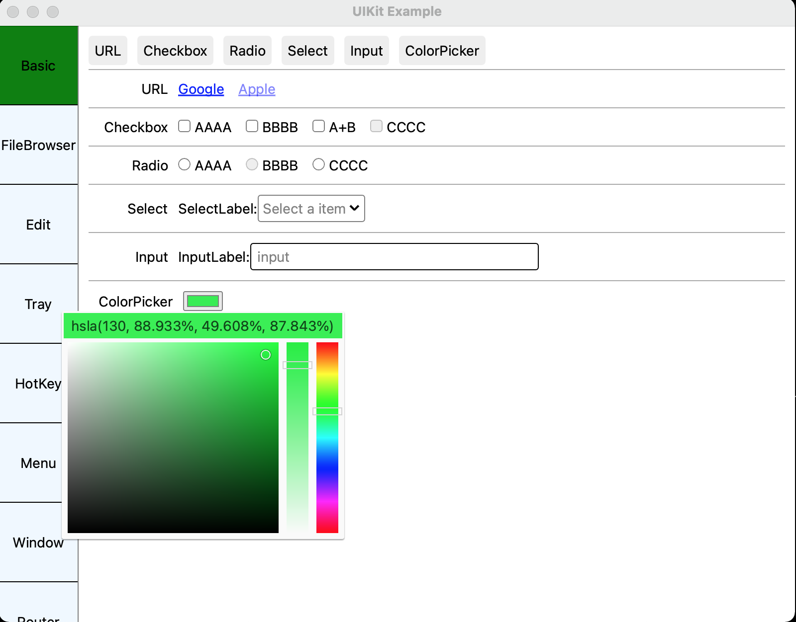

# UIKit

UIKit is a declarative, reactive GUI toolkit for build cross platform apps with web technology with single codebase.
Inspired by Flutter, React.

**Note**

I'm sorry if the project name confused you, it was named for development when i start it years ago when i know nothing about apple dev, and it will have a new name when it get to be open sourced.

# Status

The toolkit is almost ready for create apps, but still have many improvements need to be done, such as accessibility
texture view, web view, and so on...

Download the prebuilt example demo here: [https://github.com/zhuah/uikit/releases/download/v0.0.1/macos_linux_windows.tgz]().

As my development OS is macOS, there may some bugs on linux and windows.

I have worked on it for almost 3 years.
For some reason, i'm looking for financial support or business cooperation or acquisition on this project.

To contact me please send email to [zzhuah@outlook.com](mailto:zzhuah@outlook.com).

# Screenshots

# Language

UIKit is written in Go for several reasons:

- Simple and easy to learn and use
- Memory safe
- Cross platform with good standard library
- Good performance
- Static typed with generic support
- Easy build/deploy, compiles to single binary, no bundled runtime dependence
- Good for handling network connections
- Sharing code with backend services, one language for both client and server

some drawbacks:

- hot reload:

  there is no easy way to support code hot reload in Go. We supports css asset file hot reload instead, which will significantly helps user experience when adjust styles.

- thread safe:

  ui thread are always not thread safe for performance reason. Unlike javascript which is single threaded, or other language with async/await support, a Go program will typically run with multiple goroutines, you must wrap ui modification with `RunInUI` function in non-ui goroutine.

# Features

UIKit = React + Hooks + DOM + Gestures + CSS + Animation + Text Layout + Fonts + Canvas + GPU Acceleration + Platform Shell + Assets + I18N + Plugins + DevTool + ...

## Widget/Component

The widget system is inspired by React, but provides only function
component and hooks.

JSX is not supported now, so we can only write Go code to construct the widget tree, it's just like Flutter, but moving styling into CSS file.

## DOM

DOM elements are respond for event handling and style matching.

Builtin features:

- tab focus with outline
- disable element
- auto focus
- text selection
- scroll

Builtin elements:

- a
- button
- canvas
- checkbox
- div
- radio
- input
- textarea
- img
- label
- p: multiline rich text layout, supports both text span and widget span
- select
- span
- style: scoped style element like vue
- popup-container: manage tooltips, popups and modal dialogs.

Element states:

- focus
- active
- focusWithin
- drag and drop
- hover

Builtin gestures:

- tap
- double tap
- long press
- dragging

## Components:

- color picker
- switch
- css transition/switch transition/transition group(inspired by React)

## Style/CSS

UIKit implements a custom css styler supports:

- hot reload with devtool
- importing
- nested selector
- scss variables(compile time)
- css variables(running time)
- id/class/tag/pseudo class/pseudo element/any/not selector
- child/descendant/general sibling/adjacent sibling combinator
- px/em/rem/vh/vw/vmin/vmax/safe-area-insets/currentColor
- transition/animation,keyframes
- media query

supported pseudo classes:

- hover
- any-link
- active
- focus
- focus-visible
- focus-within
- disabled
- selected
- checked
- indeterminate
- drop
- horizontal
- vertical

supported css properties:

- transition-property
- transition-duration
- transition-timing-function
- transition-delay
- transition
- animation-name
- animation-direction
- animation-fill-mode
- animation-iteration-count
- animation-duration
- animation-timing-function
- animation-delay
- animation
- border-left-style
- border-right-style
- border-start-style
- border-end-style
- border-top-style
- border-bottom-style
- border-style
- border-left-width
- border-right-width
- border-start-width
- border-end-width
- border-top-width
- border-bottom-width
- border-width
- border-left-color
- border-right-color
- border-start-color
- border-end-color
- border-top-color
- border-bottom-color
- border-color
- border-left
- border-right
- border-start
- border-end
- border-top
- border-bottom
- border
- border-top-left-radius
- border-top-right-radius
- border-top-start-radius
- border-top-end-radius
- border-bottom-left-radius
- border-bottom-right-radius
- border-bottom-start-radius
- border-bottom-end-radius
- border-radius
- overflow-x
- overflow-y
- overflow
- content-align
- background-clip
- background-color
- background-image: image, linear-gradient, radial-gradient, conic-gradient
- background-origin
- background-size
- background-repeat
- background-position
- background
- box-shadow
- outline-style
- outline-color
- outline-offset
- outline-width
- outline-radius
- outline
- object-fit
- object-position
- transform
- transform-origin
- arrow-size
- direction
- visibility
- cursor
- opacity
- filter: drop-shadow and blur doesn't supported currently for performance issue
- display: builtin supports none, flex, stack
- flex
- flex-direction
- flex-wrap
- justify-content
- align-items
- align-self
- align-content
- z-index
- stack-align-self
- margin-left
- margin-right
- margin-start
- margin-end
- margin-top
- margin-bottom
- margin
- padding-left
- padding-right
- padding-start
- padding-end
- padding-top
- padding-bottom
- padding
- min-width
- min-height
- max-width
- max-height
- width
- height
- aspect-ratio
- font-family
- font-size
- font-feature-settings
- font-language-override
- font-stretch
- font-style
- font-weight
- caret-color
- placeholder-color
- letter-spacing
- line-height
- color
- selection-color
- text-shadow
- text-transform
- text-decoration-line
- text-decoration-style
- text-decoration-color
- text-decoration-thickness
- text-decoration
- text-wrap
- text-align

# Platforms

Implemented:

- [x] macOS
- [x] Linux (the shell is implemented with gtk3 currently)
- [x] Windows (the minimum supported version is windows 7)
- [x] Android
- [x] iOS

Todo:

- [ ] Web
- [ ] Embedded linux

## Plugins

UIKit provides a general api to call system capabilities by implement plugins.

Here are some builtin plugins:

- clipboard
- cursor
- file drag and drop
- file choose/save
- system global hot key
- menubar
- context menu
- text input
- tray
- url launcher

# Painting

UIKit finally chooses to build it's own canvas drawing engine,instead of relies on Skia or platform drawing api.

## Canvas

UIKit implements a gpu based canvas drawing engine, with merge and batching draw calls
to improve performance.

## GPU Acceleration

Implemented:

- [x] OpenGL 2.1+ /OpenGL ES 2.0+(macOS, Linux, Windows, Android, iOS)
- [x] Metal(macOS, iOS)
- [x] D3D11(Windows)

Todo:

- [ ] D3D12
- [ ] Vulkan
- [ ] WebGL

## Fonts

UIKit uses different font stack on each platform

- macOS/iOS: CoreText everywhere
  - font shaping
  - rasterizing
  - font matching and fallback
- Linux:
  - fontconfig for font enumeration
  - custom font matching and fallback
  - harfbuzz for font shaping
  - freetype for font rasterizing
- Android:
  - NDK API or directory searching for font enumeration
  - custom font matching and fallback
  - harfbuzz for font shaping
  - custom font rasterizing
- Windows:
  - DirectWrite font enumeration
  - custom font matching and fallback
  - DirectWrite for font shaping
  - custom font rasterizing

## Performance

Tested with the example app on my old mid 2015 mbp, the average duration per frame are about 2ms with Metal and 3ms with OpenGL.

# Assets

UIKit provides a default asset bundler in command line tool, each platform shell implements the api to load asset file, the core asset api implements a asset variant resolver support dpi like `1.0x, 1.5x, 2.0x, ldpi, mdpi, hdpi` and language.

# I18n

UIKit provides first-class i18n support. You could use react hooks to translate the message and passed the translated text to dom element.

# DevTool

UIKit provides a basic component/dom tree inspector like Chrome DevTool Inspector, which helps debugging style/layout issues.

# TODO

- App Bundler
- Accessibility
- SVG
